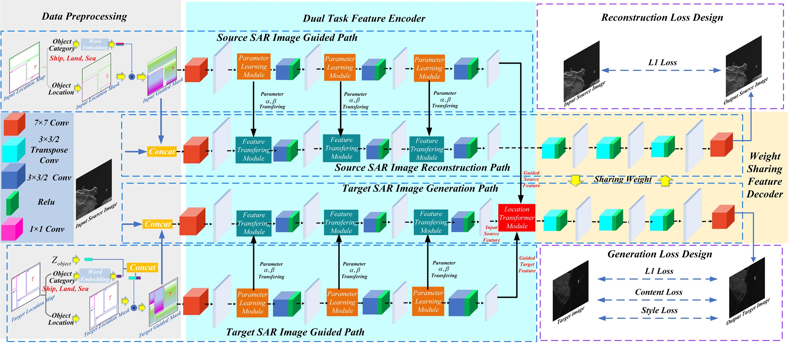
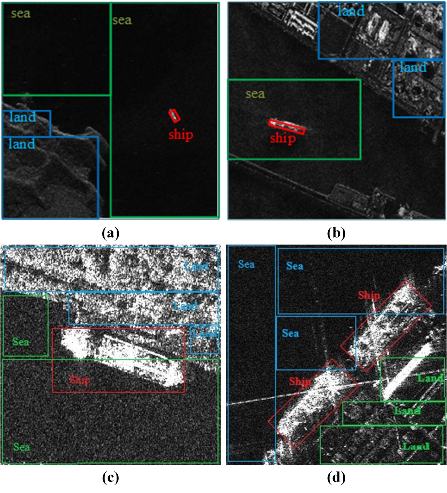
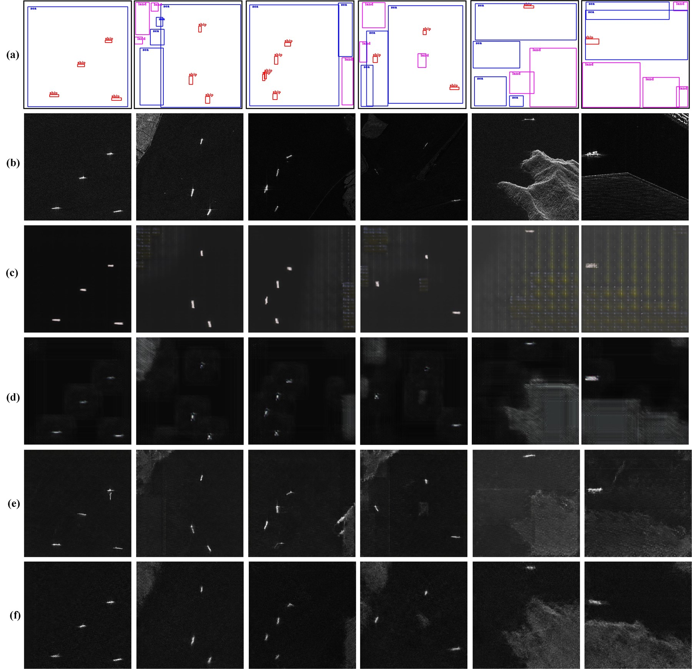
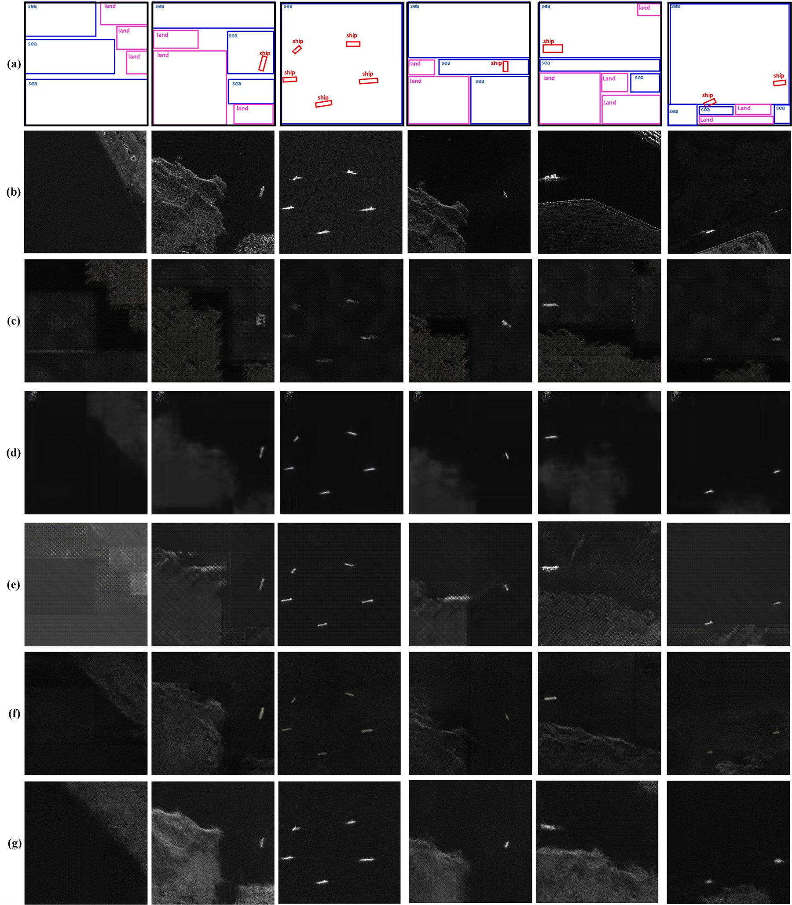

<div align="center">

# LADT-SAR

### A Location-Aware Dual-Task Generation Model for High-Resolution SAR Images in Complex Backgrounds

<p>
  
  
  
  
  
</p>

Source-content-guided and location-controlled SAR scene generation with
explicit ship, land, and sea layout guidance.

</div>

---

## Overview

LADT-SAR is designed for controllable high-resolution synthetic aperture radar
(SAR) image generation in complex maritime scenes. Instead of learning a
direct mapping from a location mask to an image, the framework takes an
observed **source SAR image**, a **source guidance mask**, and a **target
guidance mask** as inputs.

The source image provides scene-specific appearance cues, including local
texture, clutter, contrast, and background characteristics. The target guidance
mask specifies the desired arrangement of ships, land, and sea. The model then
learns a source-to-target scene transformation that preserves SAR content while
reorganizing the semantic layout.

<p align="center">
  
</p>

<p align="center"><i>Overall architecture of the proposed LADT-SAR framework.</i></p>

## Highlights

- **Source-content guidance.** An observed SAR image supplies instance-specific
  appearance information that is unavailable in a location mask alone.
- **Controllable scene layout.** Source and target semantic masks explicitly
  describe the locations of ships, land, and sea.
- **Dual-task learning.** A source-image reconstruction path regularizes the
  shared representation while the generation path synthesizes the target
  scene.
- **Multi-scale feature modulation.** PLM predicts spatially varying parameters
  and FTM applies them to transfer source-content features across multiple
  scales.
- **Directional correspondence.** GMTM models height- and width-direction
  relationships between source and target guidance features.
- **HBB and OBB support.** Both horizontal and oriented ship annotations are
  evaluated on HRSID and SSDD.

## Method at a Glance

| Component | Full name | Purpose |
|---|---|---|
| Reconstruction path | Source SAR image reconstruction path | Preserves source-scene content and provides auxiliary supervision |
| Generation path | Target SAR image generation path | Synthesizes a target scene according to the target guidance mask |
| PLM | Parameter Learning Module | Predicts spatially varying affine-modulation parameters from guidance features |
| FTM | Feature Transferring Module | Transfers and modulates source-content features at multiple scales |
| GMTM | Guided Mask Transformer Module | Establishes directional correspondence between source and target layouts |
| Shared decoder | Weight-sharing reconstruction/generation decoder | Transfers reconstruction knowledge to the generation task |

The model operates in four conceptual stages:

1. Encode the source SAR image and the source/target guidance masks.
2. Learn spatially varying modulation parameters and exchange content-guidance
   information through PLM and FTM.
3. Establish directional source-target correspondence through GMTM.
4. Decode the transformed features into the target SAR image while jointly
   reconstructing the source image during training.

## Semantic Guidance and Annotation

Each guidance mask contains three semantic channels aligned with the SAR image:

| Channel | Semantic class | Description |
|---:|---|---|
| 0 | Ship | Ship target regions represented by HBBs or OBBs |
| 1 | Land | Land, coastline, harbor, and related terrestrial regions |
| 2 | Sea | Maritime background and sea-clutter regions |

### Bounding-box formats

- **HBB (horizontal bounding box):** an axis-aligned rectangle enclosing a
  ship target.
- **OBB (oriented bounding box):** a rotated rectangle that follows the ship's
  principal orientation and more tightly describes its spatial extent.

The ship annotation format changes between HBB and OBB experiments, while land
and sea retain the same semantic meaning. Representative semantic annotations
are shown below.

<p align="center">
  
</p>

<p align="center"><i>Representative ship, land, and sea annotations used to construct semantic guidance masks.</i></p>

### Representative generation results

| HBB-guided generation | OBB-guided generation |
|:---:|:---:|
|  |  |

> The images above are representative visualization samples only. They do not
> constitute the complete experimental dataset.

## Datasets

Experiments are conducted on two public SAR ship datasets with additional
semantic annotations for location-controlled generation.

| Dataset | Original task | Added information in this work | Guidance formats |
|---|---|---|---|
| [HRSID](https://github.com/chaozhong2010/HRSID) | Ship detection and instance segmentation in high-resolution SAR images | Ship/land/sea semantic guidance and source-target pair construction | HBB and OBB |
| [SSDD](https://github.com/TianwenZhang0825/Official-SSDD) | SAR ship detection | Ship/land/sea semantic guidance and image-disjoint train/validation/test splits | HBB and OBB |

The original SAR images remain subject to the terms and licenses of their
respective providers. This repository does not redistribute the complete HRSID
or SSDD image collections.

<details>
<summary><b>Derived data required for exact reproduction</b></summary>

An exact reproduction package should contain:

- added land and sea annotations;
- HBB and OBB ship annotations used in each experiment;
- selected-image lists;
- train, validation, and test split files;
- source-target pair CSV files;
- class definitions and annotation protocol; and
- scripts for reconstructing the experimental directory structure after the
  original datasets have been downloaded.

</details>

## Evaluation Protocol

The framework is evaluated from complementary perspectives:

| Evaluation aspect | Metrics or protocol |
|---|---|
| Distribution quality | Frechet Inception Distance (FID) and SAR-domain feature-distribution distance |
| Paired fidelity | PSNR, SSIM, and LPIPS |
| Structural preservation | Edge Preservation Distance (EPD) |
| SAR intensity characteristics | Homogeneous-sea ENL discrepancy and ship/land/sea Jensen-Shannon divergence |
| Downstream utility | YOLO-based ship detection using AP50, AP50:95, precision, recall, and F1 score |
| Computational cost | Parameters, MACs, FLOPs, inference time, and FPS |

HRSID and SSDD results are reported separately under HBB and OBB guidance. For
region-wise SAR statistics, the same spatially aligned semantic masks are
applied to paired real and generated images.

## Public Repository Contents

```text
.
|-- assets/
|   |-- framework_preview.jpg
|   |-- annotation_preview.jpg
|   |-- hbb_preview.jpg
|   `-- obb_preview.jpg
|-- .gitignore
|-- README.md
`-- requirements.txt
```

This public repository is a **project and annotation preview**. It currently
contains the method overview, representative annotation visualizations, and a
reference environment specification. It does not contain the complete training
implementation, full derived annotation set, model checkpoints, or original
HRSID/SSDD images.

## Environment

### Reference configuration

| Item | Version |
|---|---|
| Operating system | Linux |
| Python | 3.8 |
| PyTorch | 2.0.1 |
| Torchvision | 0.15.2 |
| CUDA | Select a build compatible with the local NVIDIA driver |

### Installation

```bash
git clone <repository-https://github.com/Pluto-cc/LADT-SAR>
cd LADT-SAR

python -m venv .venv
source .venv/bin/activate
python -m pip install --upgrade pip
python -m pip install -r requirements.txt
```

For Windows PowerShell:

```powershell
python -m venv .venv
.venv\Scripts\Activate.ps1
python -m pip install --upgrade pip
python -m pip install -r requirements.txt
```

For GPU execution, install the PyTorch build corresponding to the local CUDA
runtime by following the official PyTorch installation instructions.

## Availability Statement

The complete training implementation, checkpoints, and full derived annotation
set are not part of this public preview release. Availability of additional
research materials is subject to institutional approval and the licenses of
the underlying HRSID and SSDD datasets.

## Citation

The manuscript is currently under review. Bibliographic information will be
added after publication.

```bibtex
@article{ladtsar,
  title   = {A Location-Aware Dual-Task Generation Model for High-Resolution
             SAR Images in Complex Backgrounds},
  author  = {Anonymous},
  journal = {Under Review},
  year    = {2026}
}
```

## Acknowledgments

This project builds on ideas and implementation patterns from guided
image-to-image translation, Pix2pix, and CycleGAN. We thank the authors of
HRSID and SSDD for making their SAR ship datasets available to the research
community.

## License and Data Use

Code, figures, annotations, and third-party dataset images may be governed by
different licenses. Verify redistribution permission for every uploaded asset.
The inclusion of a representative HRSID or SSDD image in this repository does
not override the terms of the original dataset provider.
